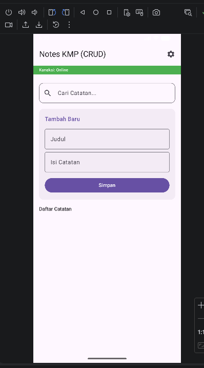
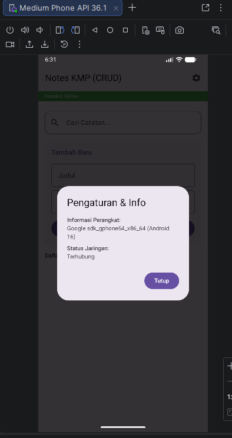
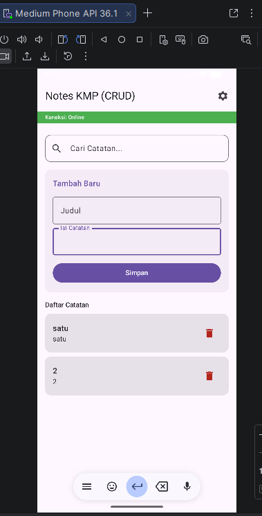
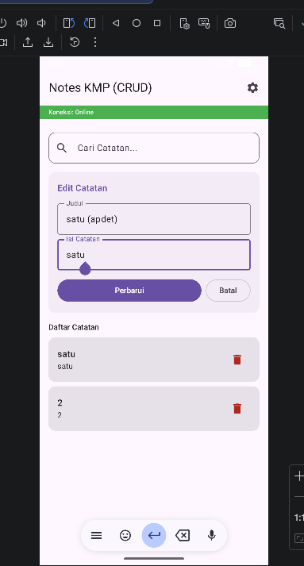
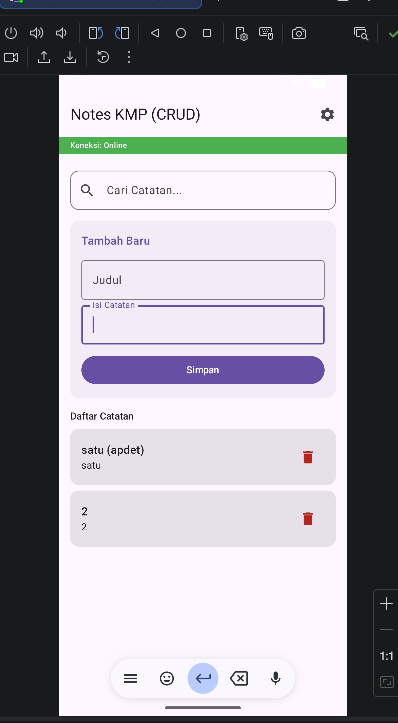
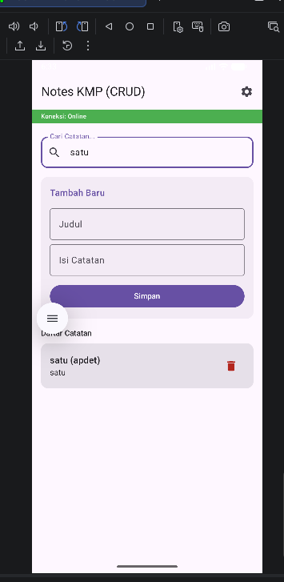
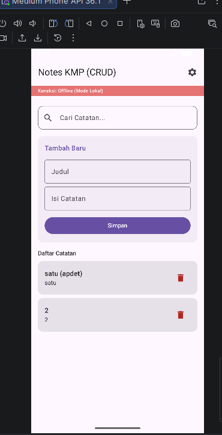

# Notes KMP (Kotlin Multiplatform) - CRUD App

Aplikasi catatan sederhana yang dibangun menggunakan Kotlin Multiplatform (KMP). Proyek ini mendemonstrasikan implementasi *shared logic* antara Android dan platform lainnya, dengan fokus pada Dependency Injection, Database Lokal, dan pemantauan status perangkat secara real-time.

## 🏗️ Arsitektur Sistem

Aplikasi ini menggunakan arsitektur Clean Architecture sederhana yang dipadukan dengan pola Expect/Actual untuk menangani fungsionalitas spesifik platform.

### Komponen Utama:
1.  **Shared Module (CommonMain):** Berisi logika bisnis, definisi database (SQLDelight), dan kontrak (expect) untuk fitur platform.
2.  **Koin DI:** Digunakan sebagai pengatur dependensi (Dependency Injection) di seluruh aplikasi agar objek seperti Database dan NetworkMonitor dapat digunakan secara konsisten.
3.  **SQLDelight:** Mesin database SQLite yang menghasilkan tipe data aman (Type-safe) untuk operasi CRUD.
4.  **Expect/Actual:** Mekanisme untuk mengakses API spesifik platform (seperti informasi sensor atau konektivitas) dari kode bersama.

---

## 🛠️ Implementasi Fitur Sesuai Tugas

Berikut adalah detail implementasi untuk memenuhi persyaratan teknis:

### 1. Dependency Injection (Koin)
Seluruh objek dalam aplikasi diatur melalui Koin. 
- **AppModule:** Mengatur pembuatan instance `NotesDatabase`.
- **PlatformModule:** Mengatur instance yang butuh `Context` Android seperti `DatabaseDriverFactory` dan `NetworkMonitor`.

### 2. Device Info (Expect/Actual)
Fitur ini mendeteksi informasi perangkat pengguna.
- **Expect:** Mendefinisikan class `DeviceInfo` di `commonMain`.
- **Actual:** Mengambil `android.os.Build.MODEL` di `androidMain`.
- **UI:** Ditampilkan pada layar utama/settings untuk memberikan detail teknis perangkat kepada pengguna.

### 3. Network Monitor (Expect/Actual)
Memantau status koneksi internet secara real-time.
- **Expect:** Kontrak untuk mendengarkan perubahan jaringan.
- **Actual:** Menggunakan `ConnectivityManager` di Android.
- **UI:** Indikator status (Online/Offline) ditampilkan secara dinamis di bagian atas aplikasi (Top Bar).

### 4. Database Lokal (SQLDelight)
Menyimpan catatan pengguna secara permanen.
- Mendukung operasi: **Create** (Tambah), **Read** (Lihat & Cari), **Update** (Ubah), dan **Delete** (Hapus).
- Sinkronisasi data menggunakan `Flow` sehingga UI otomatis terupdate saat data berubah.

---

## 🚀 Cara Menjalankan Proyek

1.  Clone repository ini.
2.  Buka di **Android Studio (version Ladybug atau yang lebih baru)**.
3.  Pastikan plugin **Kotlin Multiplatform** sudah terinstall.
4.  Pilih konfigurasi run `composeApp` dan jalankan di Emulator Android.

## 📋 Teknologi yang Digunakan
- **Kotlin Multiplatform**
- **Compose Multiplatform** (UI Framework)
- **Koin** (Dependency Injection)
- **SQLDelight** (Local Persistence)
- **Kotlin Coroutines & Flow** (Asynchronous Logic)

## Screenshot

